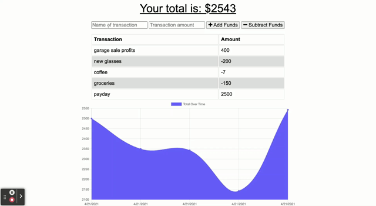
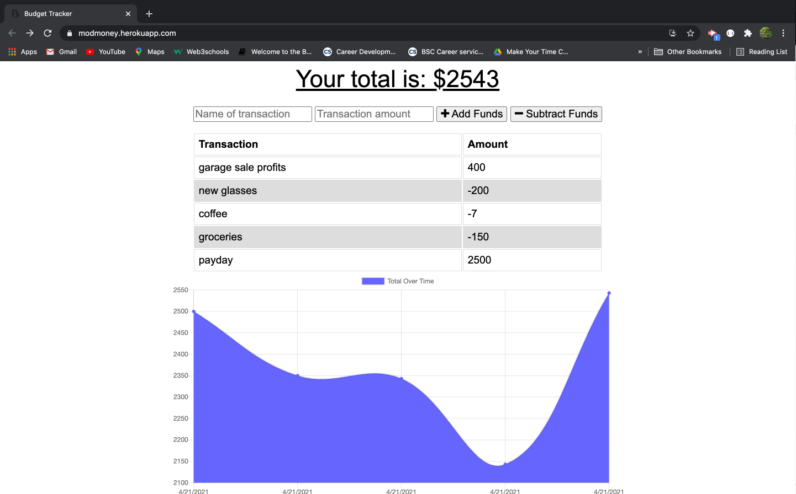

# ModMoney

## Badge


## Description

A progressive web application for planning and monitoring your budget on the go, with or without an internet connection.

View and interact with the deployed application [here](https://modmoney.herokuapp.com/)!

## Table of Contents

- [Installation](#Installation)
- [Usage](#Usage)
- [Languages/Technologies](#Languages/Technologies)
- [Contributing](#Contributing)
- [Test](#Tests)
- [Questions](#Questions)
- [License](#License)

## Installation

First, clone the repo and save it to your local environment. Next, run npm i to install dependencies. Finally, run npm start to start the server and open in your browser to begin budgeting.

[Back to Table of Contents](#table-of-contents)

## Usage

Featuring an intuitive UI, the user simply enters the name and amount of the expense or credit and clicks the button to either subtract or add funds to their budget. If they're working offline, data will be stored in the indexedDB until a network connection is re-established.  When back online, the stored data is sent to the user's database, allowing the user to budget on the go.

Simple demo:



Screenshot:


[Back to Table of Contents](#table-of-contents)

## Languages/Technologies 

This application utilizes MongoDB, Mongoose, Express, Node, Morgan, CSS, HTML, and is powered by JavaScript. The demo application is deployed on Heroku and utilizes MongoAtlasDB.

[Back to Table of Contents](#table-of-contents)

## Contributing

Please review the community standards for contributing to this project, adopted from the [Contributor Covenant](https://www.contributor-covenant.org/).

[Back to Table of Contents](#table-of-contents)

## Tests

```bash
No tests at this time.
```

[Back to Table of Contents](#table-of-contents)

## Questions

Questions? You can reach me by email at jennifer.nelson242@gmail.com. Feel free to check out additional projects at [my GitHub profile](https://github.com/jnel-221).

[Back to Table of Contents](#table-of-contents)

## License

This project is licensed under the terms of the [MIT license](LICENSE).

[Back to Table of Contents](#table-of-contents)
